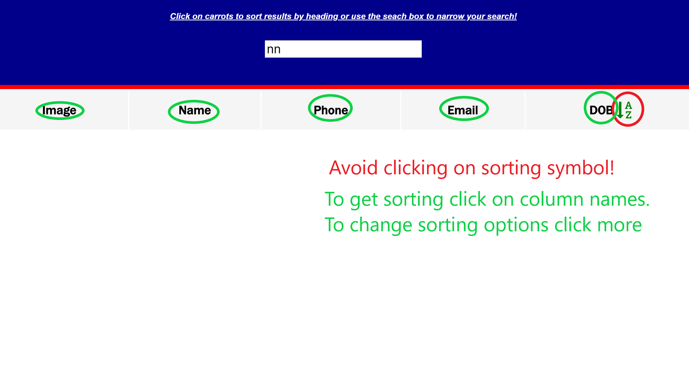
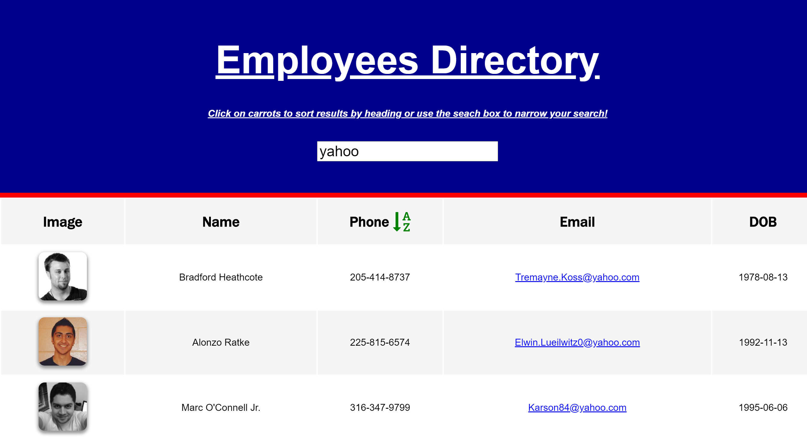
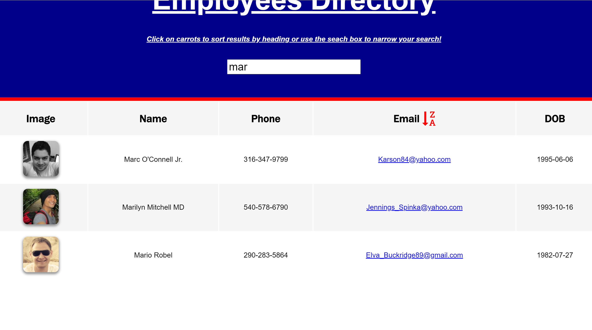
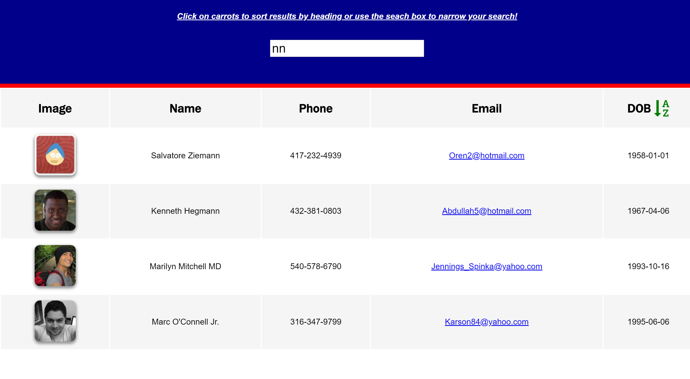

#  Employee Directory 
## Description 
### Overview
This project creates a employee directory with React. It requires to break up application's UI into components, manage component state, and respond to user events.
Using faker.js I get a table of random users, when the user loads the page, a table of employees should render. 

### User Story

* As a user, I want to be able to view my entire employee directory at once so that I have quick access to their information.

## Business Context

An employee or manager would benefit greatly from being able to view non-sensitive data about other employees. It would be particularly helpful to be able to filter employees 
by name, date of birth, email, phone number and sort the table by at 4 different categories

## Table of Contents
* [Installation](#installation)
* [Usage](#usage)
* [License](#license)
* [Questions](#questions)
* [Review](#review)
## Installation 
Simply clone the repo. To run locally 

```yarn install```

```yarn start ```

 or visit the deployed page link to begin usage.
## Usage 
Visit the deployed page [link](https://sbolotnikov.github.io/employee-directory-react/)

Some friendly reminder. No need to click on Image header
 
Overall page look with sorting by phone number ascending
 
Example of sorting by email descending
 
Example of sorting by name ascending
 
Example of sorting by date of birth ascending
 


## Contributing 
 None 
## License 
 Licensed under MIT License. 
## Tests 
 None
## Questions 
 You can see more of my Projects on my [GitHub profile](https://github.com/sbolotnikov) 

 Contact [sbolotnikov](mailto:sbolotnikov@gmail.com) 
## Review 
  * Here is this repo link: https://github.com/sbolotnikov/employee-directory-react
 
  * Link: [ Employee Directory](https://sbolotnikov.github.io/employee-directory-react)